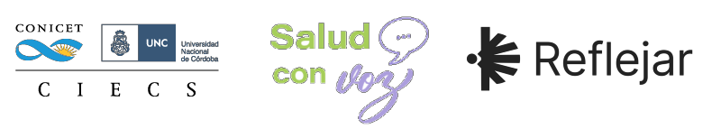

# Plataforma CP QOL - Salud con Voz

[](https://github.com/reflejar/salud-con-voz/blob/main/LICENSE)

Sistema para registro de Cerebral Palsy Quality of Life Questionnaire (CP QOL) - CIECS - CONICET/Fac. de Ciencias Sociales, Universidad Nacional de Córdoba (UNC)

## Setup

> #### ⚠️ Prerequisitos
> 
> Este entorno virtual requiere de:
> - [Docker](https://docs.docker.com/engine/install/_) y (docker) compose (que en las nuevas versiones ya viene en la instalación de docker)
> Si estás en Windows es necesario que enciendas Docker Engine que por lo general se hace abriendo Docker Desktop

### Instalación

Abrí una terminal del sistema en el directorio raiz del proyecto. Crear las variables de entorno en el archivo `.env.local` partiendo desde `.env.list` y luego construí la imagen de docker

```bash
$ cp .env.dist .env
$ docker compose build
```

Luego se debe crear una base de datos en mysql que se llame "salud_con_voz".
Para eso necesitamos acceder al contenedor de mysql llamado `ddbb`

```bash
$ docker compose up ddbb -d
$ docker compose exec ddbb bash
```

Una vez adentro, accedemos, a su vez, a la consola de mysql. escribimos `mysql -u root`. Luego, en la consola de mysql escribimos `CREATE DATABASE salud_con_voz;`

```bash
$ bash-5.1# mysql -u root
$ CREATE DATABASE salud_con_voz;
```

Luego cortamos la ejecución 

Luego se debe migrar la base de datos y ejecutar los scripts necesarios para dejar el sistema a punto

```bash
$ docker compose run app python manage.py migrate
$ docker compose run app python manage.py createsuperuser
```

### Ejecución

Abrí una terminal del sistema en el directorio raiz del proyecto y ejecutá la imagen en un contenedor

```bash
$ docker compose up
```

### Consideraciones de ddbb

_Si se necesita generar una migración porque se creó o se modificó un modelo hay que hacer lo siguiente_

```bash
$ docker compose run app python manage.py makemigrations
```

_Y luego, al ejecutarse el "up", se migra sola_

## Licencia

El siguiente repositorio es un desarrollo de codigo abierto bajo la licencia GNU General Public License v3.0. Pueden acceder a la haciendo [click aqui](./LICENSE).


---
⌨️ con ❤️ por [reflejar](https://github.com/reflejar/) 😊